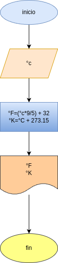

# programar 4 : convertir_en_temperatura
programar en python para convertir °c a °k y

# analisis 

### variables de entrada 
-  °c = grados celcuis

### procesamiento
- °F = grados fahrenheit
- °K = grados kelvin

- °F =( °C x 9/5) + 32
- °k = °c + 273.15

## diseno

## construccion
-codigo implementado en 
